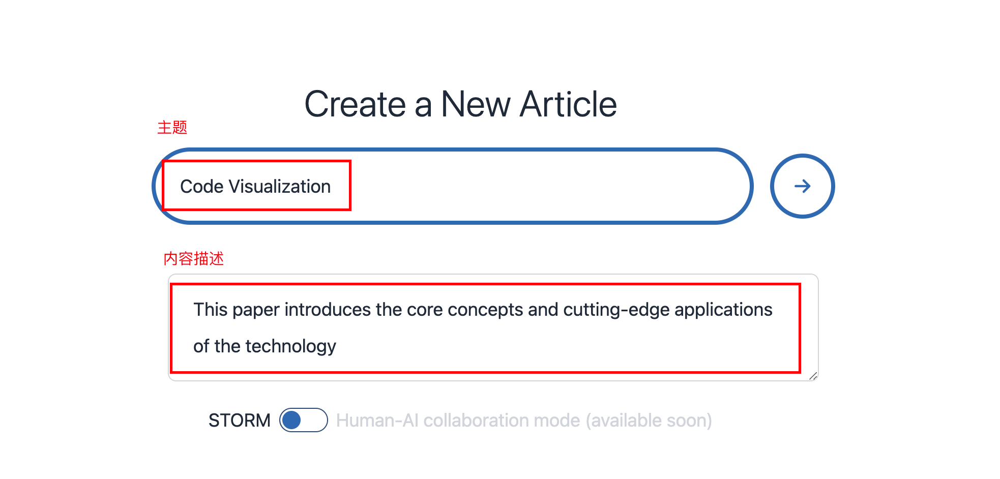
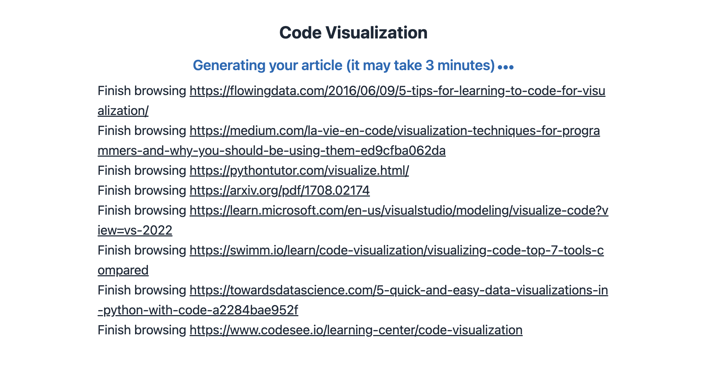
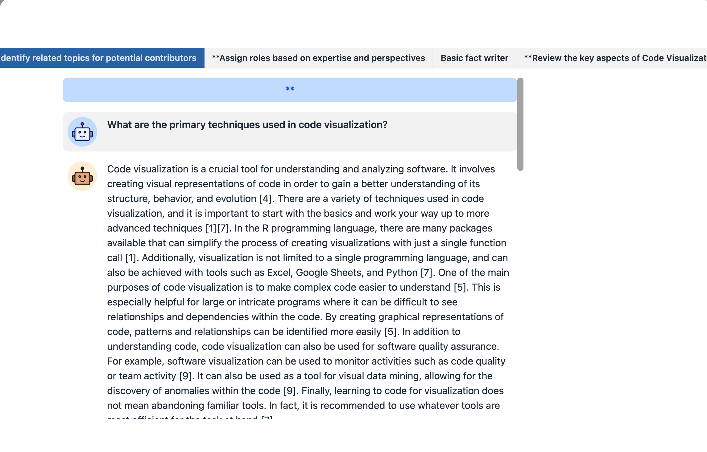
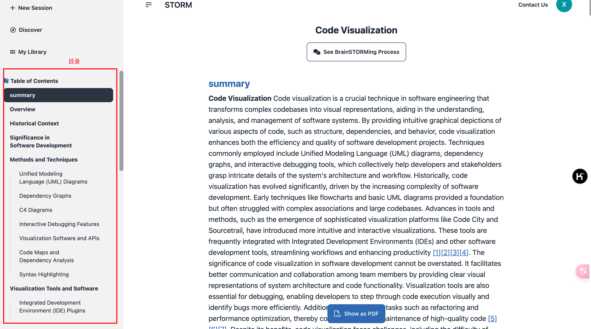
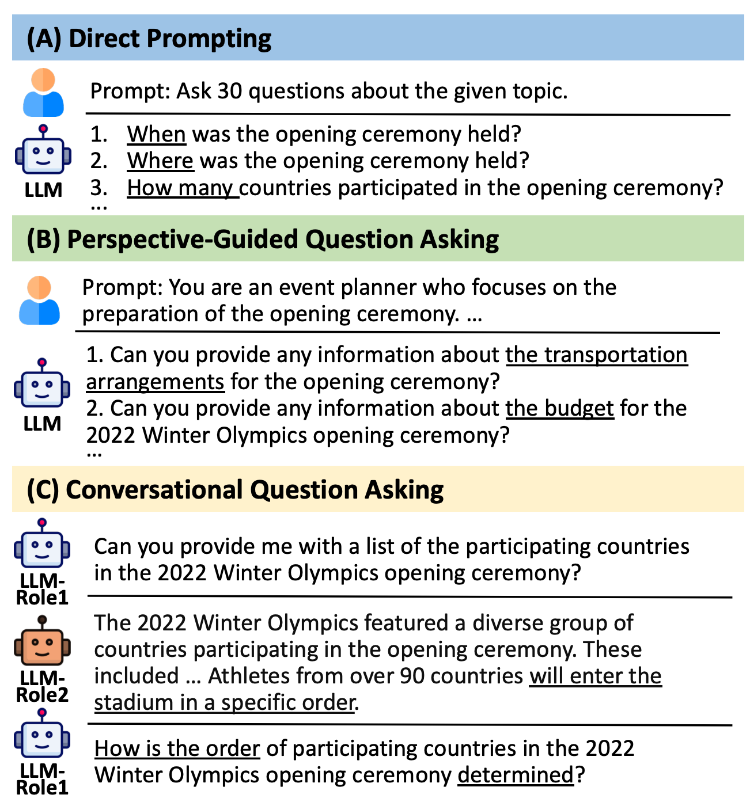
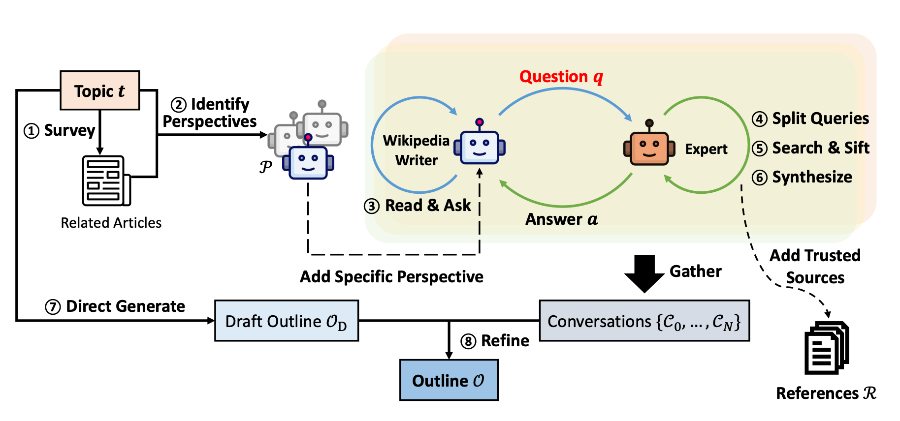

## 1. 前言
在日常开发中，为了保证技术方案的质量，一般会在撰写前进行调研。如果先前没有相关领域的知识储备，笔者的调研方式一般是先通过搜索引擎进行关键字查询，然后再基于搜索的结果进行发散。这样调研的结果受关键字抽象程度和搜索引擎排名影响较大，可能会存在偏差导致调研不充分。刚好大模型风靡有一段时间了，就想如果AI能自动检索资料并进行内容总结，岂不美哉。避免重复造轮子，先在网上检索了一下，发现刚好有一个工具“**STORM**”满足诉求。

## 2. 什么是STORM?
[STORM](https://github.com/stanford-oval/storm)是一个由斯坦福大学开发的基于大型语言模型（LLM）的知识管理系统，它能够针对特定主题进行研究，并生成带有引用的完整报告。系统分为预写阶段和写作阶段，通过互联网研究收集参考资料并生成大纲，然后利用这些信息生成带引用的全文。STORM通过视角引导提问和模拟对话来提高生成内容的质量，支持自定义检索器和语言模型，以适应不同的使用场景。基本的执行流程如下图：

## 3. 怎么使用STORM?
可以自己将仓库Clone到本地编译运行（需要设置openai_api_key）或者直接访问[STORM](https://storm.genie.stanford.edu/)试用，下面使用直接访问网页的方式进行说明。

**① 设置内容主题并描述撰写的目的**

主题设置为“代码可视化”，并将撰写目的设置为“介绍技术的核心概念和前沿应用”。

**② 自动检索互联网相关资料**

**③ 使用LLM生成文章内容**

**④ 通过模拟对话优化生成内容**

**⑤ 展示生成内容**

得到生成文章，可以下载为PDF格式。

## 4. 原理浅析
**STORM**通过两个主要阶段来生成带有引用的长篇文章：
- **预写阶段（Pre-writing stage）**：这个阶段系统基于互联网收集参考资料，并生成一个文章大纲。这是文章写作的准备阶段，帮助确定文章的结构和将要包含的关键点；
- **写作阶段（Writing stage）**：有了大纲和参考资料，系统会利用这些资料生成完整的文章，并在文章中加入适当的引用。

**STORM**的优势在于过程的自动化，特别是自动的提出好问题。但直接提示语言模型提出的问题效果并不理想，为了提高问题提问的深度和广度，STORM采用了两种策略：

- **视角引导的问题提问（Perspective-Guided Question Asking）**：通过调查类似主题相关文章来发现不同的视角，并利用这些视角来控制提问的过程；
- **模拟对话（Simulated Conversation）**：模拟了一个维基百科作者和一个互联网主题专家之间的对话，使语言模型能够更新对主题的理解并提出后续问题。

整个生成的执行流程如下，可以看到生成一篇文章会进行**多趟**的处理：

更多关于功能和原理的介绍可以阅读论文：[Assisting in Writing Wikipedia-like Articles From Scratch with Large Language Models](https://arxiv.org/abs/2402.14207)。

## 5. 总结
使用STORM做技术调研相当的舒服，只需要拿到它生成的文章进行阅读并对内容进行甄别（大模型存在幻觉问题），这极大的提升了工作效率。在大模型时代如果有人说他不知道怎么学习和查找资料，那么估计**99.9999999**...%的概率只是懒而已😁。